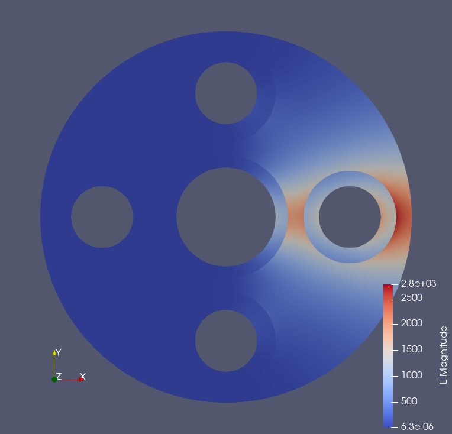
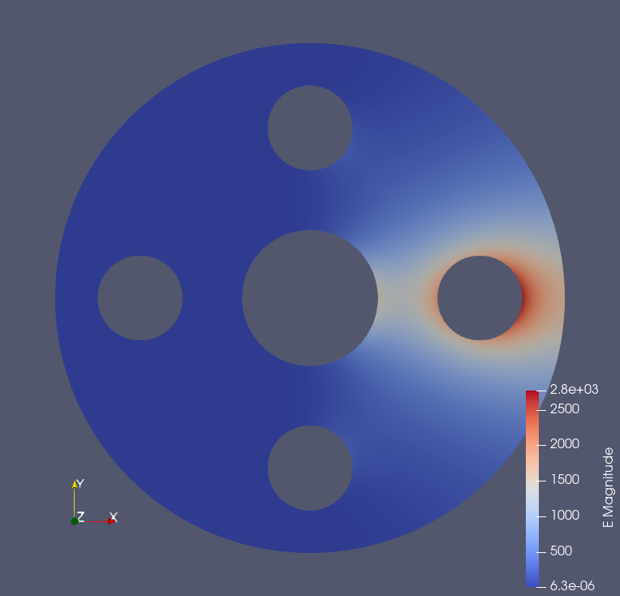

# pulmtln
[](https://github.com/lmdiazangulo/pulmtln/actions/workflows/builds-and-tests.yml)

The `pulmtln` (**P**er **U**nit **L**ength **M**ulticonductor **T**ransmission **L**ine **N**etwork) solver obtains p.u.l. $C$ and $L$ matrices of the cross-section of MTL using an electrostatic approximation. Some of its features are the following:
- p.u.l $C$ and $L$ matrix extraction.
- Third order isoparametric elements. 
- Support for dielectric materials.
- Open boundary conditions.
- Multilevel domain decomposition.
- Uses a modified [MFEM](https://mfem.org/) solver engine available [here](https://github.com/OpenSEMBA/mfem).
- Result visualization with [Paraview](https://www.paraview.org/) or [VisIt](https://visit-dav.github.io/visit-website/index.html).
- Start from `.step` CAD files using the [step2gmsh](https://github.com/OpenSEMBA/step2gmsh) workflow.

## Compiling
Compilation needs vcpkg with the packages stated in the ```vcpkg.json``` manifest. 

Additionally needs:
- mfem (with the version pointed by the external/mfem-geg submodule)

### Compiling in windows (cmake)

#### Manually (Windows/Linux)
Compile mfem in external/mfem-geg

```shell
    cmake -S external/mfem-geg -B mfem-build/rls
    cmake --build mfem-build/rls  --config Release
```

Launch cmake in root.

```shell
    cmake -S . -B pulmtln-build/rls -Dmfem_DIR=mfem-build/rls
    cmake --build pulmtln-build/rls --config Release
```

#### Compilation using presets
Configure and build presets are available. To configure

```shell 
    cmake 
        -DCMAKE_FIND_USE_PACKAGE_REGISTRY=FALSE  
        --preset "msbuild-vcpkg"
        -S <project folder>
        -B <build folder>
```

which requires the following environment variables to be set (using ```export```)

```shell
    VCPKG_ROOT=<vcpkg root folder>
    MFEM_PACKAGE=<mfem folder including cmake config package>
```

Using ```CMAKE_FIND_USE_PACKAGE_REGISTRY=FALSE``` warranties that no previously used package is used for compilation if any of the needed paths is not found (a questionable Windows _feature_). 

### Testing

Once compiled, test cases can be launched from the project root folder, with

```shell
   <build folder>/bin/Release/pulmtln_tests.exe 
```

Most cases will store results in the `Results` folder. 
Please check the codes in `test` folder for information on the validation cases and their expected tolerances.

## Usage example
Call `pulmtln` from command line as,

```shell
    pulmtln.exe -i <input file>
```

The input file must be describe a JSON object which describes the problem. An example for the `five_wires` case (available [here](testData/five_wires)) follows,

```json
    {
      "analysis": {
        "order": 3,
        "exportParaViewSolution": true,
        "exportVisItSolution": true,
        "exportFolder": "Results/five_wires/"
      },
      "model": {
        "materials": {
          "Conductor_0": {"type": "PEC", "tag": 1 },
          "Conductor_1": {"type": "PEC", "tag": 2 },
          "Conductor_2": {"type": "PEC", "tag": 3 },
          "Conductor_3": {"type": "PEC", "tag": 4 },
          "Conductor_4": {"type": "PEC", "tag": 5 },
          "Conductor_5": {"type": "PEC", "tag": 6 },
          "Dielectric_1": {"type": "Dielectric", "eps_r": 2.0, "tag": 8},
          "Dielectric_2": {"type": "Dielectric", "eps_r": 2.0, "tag": 9},
          "Dielectric_3": {"type": "Dielectric", "eps_r": 2.0, "tag": 10},
          "Dielectric_4": {"type": "Dielectric", "eps_r": 2.0, "tag": 11},
          "Dielectric_5": {"type": "Dielectric", "eps_r": 2.0, "tag": 12}
        },  
        "gmshFile": "five_wires.msh"
      }
    }
```

This object must contain the following entries: 

 + An `analysis` JSON object specifies options for the solver such as the `order` of the FEM basis and other exporting options.
 + A `model` JSON object which specifies 
   + the mesh through `gmshFile`. In this case the `five_wires.msh` file has been generated from a `.step` file using the [step2gmsh](https://github.com/OpenSEMBA/step2gmsh) program.
   + the `materials` object which identifies materials and boundaries assigned to each layer. The location in the mesh is done through its `tag` number which corresponds to a `physical model` in the mesh.

By default, `pulmtln` will generate a file called `matrices.pulmtln.out.json` which contains the $C$ and $L$ p.u.l parameters of the MTL. Each row and column corresponds to the `N` integer in `Conductor_N`. `Conductor_0` is used as reference. 
These results have been cross-compared [here][test/DriverTest.cpp] to match with [Ansys Maxwell](https://www.ansys.com/products/electronics/ansys-maxwell). 
Comparison with [SACAMOS](https://www.sacamos.org/) does not produce satisfactory because of the different underlying analytical assumptions that are made.


If `ExportParaviewSolution` and/or `ExportVisItSolution` are defined as `true` in `analysis`, `pulmtln` will also export visualization results for each simulation performed.
This means two results for each conductor different from zero: with and without accounting for dielectrics, used to compute the p.u.l $C$ and $L$ matrices, respectively.
Below there is an example of the electric fields for the `five_wires` case visualized in Paraview with (above) and without (below) considering dielectrics.




## License and copyright
``` pulmtln ``` is licensed under [BSD 3-Clause](LICENSE). Its copyright belongs to the University of Granada. 

## Acknowledgements
This project is funded by the following grants:

- HECATE - Hybrid ElectriC regional Aircraft distribution TEchnologies. HE-HORIZON-JU-Clean-Aviation-2022-01. European Union.
- ESAMA - Metodos numericos avanzados para el analisis de materiales electricos y magneticos en aplicaciones aerospaciales. PID2022-137495OB-C31. Spain.
